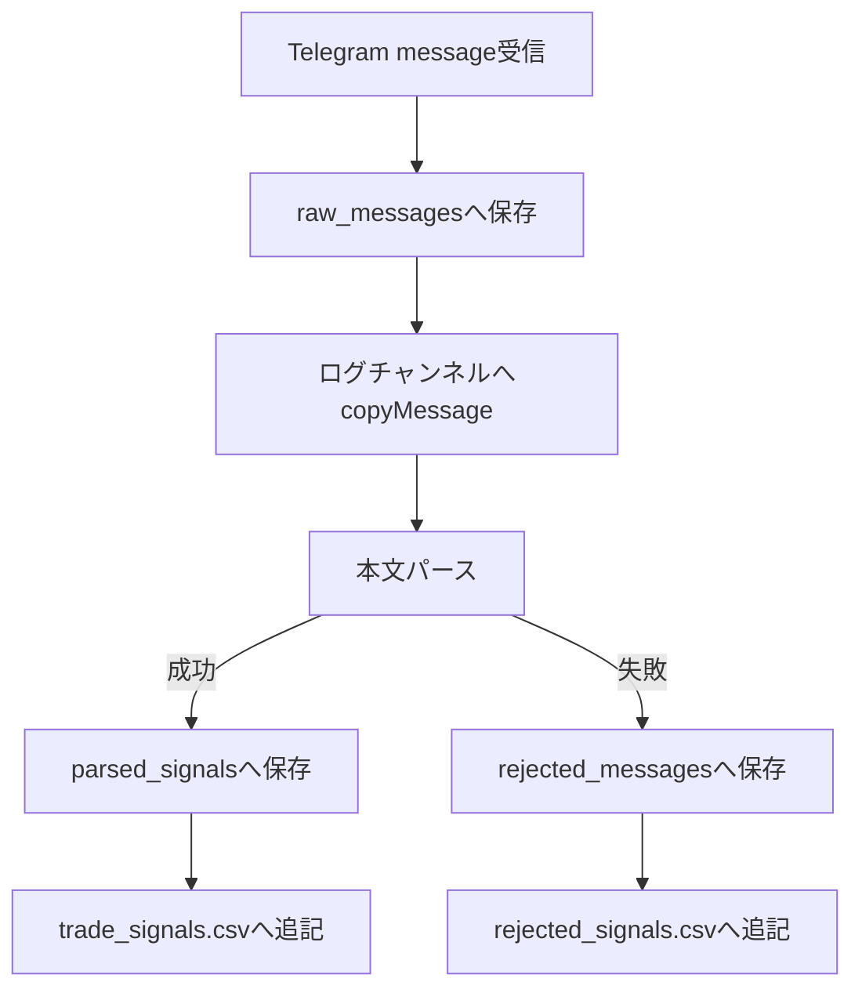

# telegram-signal-csv-bot

Telegram Bot に届いたトレードシグナル本文を polling で受信し、SQLite を正本として保存し、正規化 CSV を出力する macOS 常駐前提の Python アプリです。受信した元メッセージは、設定がある場合のみ Telegram ログチャンネルへ `copyMessage` します。

CSV は DB import、目視確認、外部連携用です。データの正本は常に SQLite です。

## ワークフロー



`copyMessage` に失敗しても、SQLite 保存、パース、CSV 出力は継続します。

## セットアップ

実行場所: プロジェクトルート

```bash
chmod +x scripts/setup_mac.sh
./scripts/setup_mac.sh
```

`scripts/setup_mac.sh` は Python 3.12 系を診断し、`.venv` 作成、pip更新、依存インストール、`.env` 作成、SQLite DB 初期化まで実行します。`.env` が既に存在する場合は上書きしません。

`requirements.txt` はバージョン未固定です。新規の小規模常駐アプリとして、まず Python 3.12 系の最新互換版を使い、必要になった段階でロックファイルやバージョン固定へ移行しやすくするためです。

## Bot Token

1. Telegram で `@BotFather` を開きます。
2. `/newbot` を実行します。
3. Bot 名と username を入力します。
4. 発行された token を `.env` の `TELEGRAM_BOT_TOKEN` に設定します。

Bot Token は `.env` のみに保存してください。launchd plist やソースコードに直接書かないでください。

## .env

実行場所: プロジェクトルート

```bash
[ -f .env ] || cp .env.example .env
```

`.env` を編集します。

```env
TELEGRAM_BOT_TOKEN=123456:example
TELEGRAM_LOG_CHAT_ID=
SIGNAL_TIMEZONE=Asia/Tokyo
SQLITE_DB_PATH=./data/signals.sqlite3
CSV_OUTPUT_PATH=./output/trade_signals.csv
REJECTED_CSV_OUTPUT_PATH=./output/rejected_signals.csv
LOG_DIR=./logs
```

`TELEGRAM_LOG_CHAT_ID` が空の場合、`copyMessage` はスキップされます。
`.env` を変更した後は、起動中のBotを一度止めて `python -m src.main` を起動し直してください。起動中プロセスは `.env` の変更を自動では再読み込みしません。

## ログチャンネルID

`.env` に `TELEGRAM_BOT_TOKEN` を設定した後に実行します。

実行場所: プロジェクトルート

```bash
source .venv/bin/activate
python -m scripts.print_chat_id
```

TelegramでBotまたはログチャンネルに `test` と送ると、ターミナルに `chat_id` が表示されます。その値を `.env` の `TELEGRAM_LOG_CHAT_ID` に設定します。ログチャンネルで確認する場合は、先にBotをチャンネルへ追加してください。

## ログチャンネル疎通確認

`.env` に `TELEGRAM_BOT_TOKEN` と `TELEGRAM_LOG_CHAT_ID` を設定した後、ログチャンネルが見つかるか、Botが投稿できるかを確認します。Bot Token は表示されません。

実行場所: プロジェクトルート

```bash
source .venv/bin/activate
python -m scripts.check_log_channel
```

成功すると `chat.id`, `chat.type`, `chat.title` が表示され、ログチャンネルに `log channel test` が投稿されます。

チャンネルへBotを追加する基本手順:

1. Telegramで対象チャンネルを開く
2. チャンネル設定から管理者を追加する
3. 作成したBotを管理者として追加する
4. 投稿権限を有効にする
5. `python -m scripts.check_log_channel` で疎通確認する

`Chat not found` の主な原因:

- `TELEGRAM_LOG_CHAT_ID` が間違っている
- チャンネルIDの `-100` が抜けている
- Botがログチャンネルまたはグループに追加されていない
- Botに投稿権限がない

本体保存テストだけ先に行う場合は `.env` の `TELEGRAM_LOG_CHAT_ID=` を空にすると `copyMessage` を一時停止できます。

## DB初期化

実行場所: プロジェクトルート

```bash
source .venv/bin/activate
python -m scripts.init_db
```

`SQLITE_DB_PATH` に SQLite DB が作成されます。既に作成済みの場合も安全に終了します。

`init_db` 実行時に既存 `parsed_signals` テーブルが古いスキーマの場合は、どのカラムが不足しているかを表示して停止します。初期実装段階のため、本格的なマイグレーション管理ツールはまだ使っていません。

## ローカルDBリセット

Entry複数点対応などのスキーマ変更後に、古い `data/signals.sqlite3` が残っていると次のようなエラーになります。

```txt
sqlite3.OperationalError: table parsed_signals has no column named entry1
```

この場合は、開発中のローカル検証データを削除してから初期化し直します。

実行場所: プロジェクトルート

```bash
source .venv/bin/activate
python -m scripts.reset_db
python -m scripts.init_db
```

確認なしで削除する場合:

```bash
python -m scripts.reset_db --yes
python -m scripts.init_db
```

`scripts.reset_db` は設定値に基づいて、SQLite DB、WAL/SHM、`trade_signals.csv`、`rejected_signals.csv` だけを削除します。`.env` と Bot Token は削除しません。ただし開発中のローカル検証データは消えるため、必要なデータがある場合は実行前に退避してください。

## Entry仕様

`Entry` は1〜5点まで許容します。

```txt
Entry | 4533
Entry | 4563 - 4568
Entry | 4563 - 4568 - 4570 - 4575 - 4580
```

保存仕様:

- 1点: `entry_type = single`
- 2点: `entry_type = range`
- 3〜5点: `entry_type = multi`
- 6点以上: rejected として保存
- `entry_min` は最小値、`entry_max` は最大値
- `entry_raw` は `Entry |` より後ろの文字列を trim した値
- `entry1`〜`entry5` は元の順番で保存し、存在しない値はNULLまたはCSV空欄

## 6点Entry rejected確認

Bot起動中に以下を送ると、6点Entryとして rejected になる想定です。

```txt
SELL XAUUSD 1m

Entry | 4563 - 4568 - 4570 - 4575 - 4580 - 4590

TP | 4559 - 4551 - 4533
SL | 4571

2026-03-22-19:28
```

確認コマンド:

```bash
cat output/rejected_signals.csv
sqlite3 data/signals.sqlite3 "select reason from rejected_messages order by id desc limit 1;"
```

`rejected_signals.csv` が無い場合は、まずTelegramから本文が届いたかを確認します。

```bash
sqlite3 data/signals.sqlite3 "select id, telegram_message_id, raw_text from raw_messages order by id desc limit 3;"
```

Telegramに依存せずDB/CSVまで通しで確認する場合は、標準入力から手動投入できます。

```bash
python -m scripts.process_sample_message --message-id manual-six-entry <<'EOF'
SELL XAUUSD 1m

Entry | 4563 - 4568 - 4570 - 4575 - 4580 - 4590

TP | 4559 - 4551 - 4533
SL | 4571

2026-03-22-19:28
EOF
```

## 手動起動

launchd 化する前に、必ず手動起動で動作確認してください。

実行場所: プロジェクトルート

```bash
chmod +x scripts/setup_mac.sh
./scripts/setup_mac.sh
```

`.env` に `TELEGRAM_BOT_TOKEN` を設定した後、以下で起動します。

```bash
source .venv/bin/activate
caffeinate -i python -m src.main
```

この状態で確認すること:

1. Telegram メッセージ受信
2. `data/signals.sqlite3` への保存
3. `output/trade_signals.csv` への出力
4. `TELEGRAM_LOG_CHAT_ID` 設定時のログチャンネルへの `copyMessage`
5. 不正メッセージの `rejected_messages` と `output/rejected_signals.csv` への保存

## launchd常駐化

手動起動で動作確認できた後に設定してください。

実行場所: プロジェクトルート

```bash
source .venv/bin/activate
./scripts/install_launch_agent.sh
```

このスクリプトは `launchd/com.nekoya.telegram-signal-csv-bot.plist.template` から実パス入り plist を生成し、`~/Library/LaunchAgents/com.nekoya.telegram-signal-csv-bot.plist` に配置します。

launchd 側には Bot Token を書きません。`.env` は Python アプリ側で読み込みます。

## 停止

実行場所: 任意

```bash
launchctl bootout "gui/$(id -u)" "$HOME/Library/LaunchAgents/com.nekoya.telegram-signal-csv-bot.plist"
```

状態確認:

```bash
launchctl print "gui/$(id -u)/com.nekoya.telegram-signal-csv-bot"
```

Terminal を閉じても launchd 起動なら Bot は動きます。Mac を再起動した後も `RunAtLoad` により起動します。ただし、Mac がスリープすると polling は止まる可能性があります。電源接続中はスリープしない設定にしてください。

## ログ確認

実行場所: プロジェクトルート

```bash
tail -f logs/app.log
```

launchd 化後に動かない場合:

```bash
tail -f logs/launchd.err.log
tail -f logs/launchd.out.log
```

## CSV再生成

SQLite を正本として、CSV を全再生成できます。
raw message 保存後にアプリが停止した場合でも、再起動時の未処理 raw 再処理後に CSV は SQLite から全再生成されます。CSV 欠落や手動修復が必要な場合も、SQLite が正本なので次のコマンドで復旧できます。

実行場所: プロジェクトルート

```bash
source .venv/bin/activate
python -m scripts.export_csv
```

生成対象:

```txt
output/trade_signals.csv
output/rejected_signals.csv
```

CSV は UTF-8 BOM 付きで出力します。

`trade_signals.csv` のカラム順:

```txt
signal_id,source,telegram_chat_id,telegram_message_id,side,symbol,timeframe,entry_type,entry_min,entry_max,entry_raw,entry1,entry2,entry3,entry4,entry5,tp1,tp2,tp3,tp4,tp5,sl,signal_time,signal_time_utc,received_at,raw_text
```

## テスト

実行場所: プロジェクトルート

```bash
source .venv/bin/activate
pytest
```

## よくあるエラー

`TELEGRAM_BOT_TOKEN が設定されていません`
: `.env` の `TELEGRAM_BOT_TOKEN` を設定してください。

`.venv/bin/activate がない`
: 原因は `.venv` がまだ作成されていないことです。次を実行してください。

```bash
chmod +x scripts/setup_mac.sh
./scripts/setup_mac.sh
```

`pyenv: python: command not found`
: 原因は pyenv に Python は入っているが、`local` / `global` / `shell` のどれにも有効化されていない、または `python` ではなく `python3.12` を使う必要がある状態です。対応例:

```bash
pyenv local 3.12.10
pyenv exec python -V
```

または:

```bash
python3.12 -m venv .venv
```

`python3.12: command not found`
: 原因は Python 3.12 の実行コマンド名が違う、pyenv 管理下にあるが有効化されていない、または Python 3.12 自体が未導入であることです。対応:

```bash
pyenv versions
pyenv local 3.12.10
pyenv exec python -V
```

Python 3.12 系が見つからない場合、Homebrewやpyenvのインストールはこのリポジトリでは自動実行しません。手動で Python 3.12 を導入してから、もう一度 `./scripts/setup_mac.sh` を実行してください。

`TELEGRAM_LOG_CHAT_ID` 設定時に `copyMessage` が失敗する
: Bot がログチャンネルに追加されているか、投稿権限があるかを確認してください。失敗理由は `raw_messages.copy_error` と `logs/app.log` に残ります。

`copyMessage` が `Chat not found` になる
: `TELEGRAM_LOG_CHAT_ID` が間違っている、Botがログチャンネルまたはグループに追加されていない、Botに投稿権限がない、チャンネルIDの `-100` が抜けている可能性があります。本体保存テストだけ先に行う場合は `.env` の `TELEGRAM_LOG_CHAT_ID=` を空にしてください。

`table parsed_signals has no column named entry1`
: 古いSQLiteスキーマが残っています。`source .venv/bin/activate` 後、`python -m scripts.reset_db` と `python -m scripts.init_db` を実行してください。

launchd では動かないが手動起動では動く
: `logs/launchd.err.log` を確認してください。`.venv/bin/python` と `.env` が存在するかも確認してください。

CSV が更新されない
: SQLite に保存されていれば復旧できます。`python -m scripts.export_csv` で全再生成してください。

## セキュリティ注意点

- `.env` は Git 管理しません。
- Bot Token をログ、README、launchd plist、ソースコードに直接書かないでください。
- Telegram API のHTTPログに含まれるBot Tokenはアプリログ出力前にマスクされます。
- Bot Token がログに出た場合は漏洩扱いにし、BotFatherでTokenを再発行して `.env` の `TELEGRAM_BOT_TOKEN` を差し替えてください。
- `logs/app.log` を外部へ貼る前に、Bot Tokenや秘密情報が含まれていないか必ず確認してください。Tokenが含まれる古いログは外部共有せず、必要なら削除してください。
- `.env.example` にはダミー値または空値のみを置いてください。
- SQLite を正本にし、CSV だけを正本として扱わないでください。

## 主なファイル

```txt
src/main.py              # polling 起動エントリーポイント
src/parser.py            # シグナル本文パーサー
src/database.py          # SQLite 初期化と保存処理
src/csv_exporter.py      # CSV 追記と全再生成
src/telegram_bot.py      # Telegram polling と copyMessage
scripts/init_db.py       # DB 初期化
scripts/reset_db.py      # ローカルDBリセット
scripts/export_csv.py    # CSV 全再生成
scripts/setup_mac.sh     # macOS 初回セットアップ
scripts/print_chat_id.py # chat_id 確認
scripts/check_log_channel.py # ログチャンネル疎通確認
```
